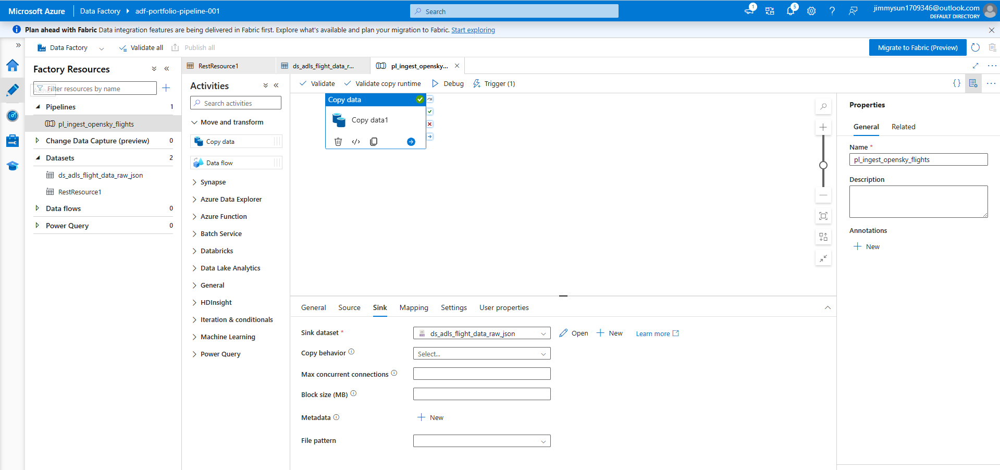

# Azure Data Engineering Pipeline: Global Flight Tracking

## Project Overview
This project is an end-to-end data engineering solution built entirely within the Microsoft Azure ecosystem. It ingests, stores, transforms, and visualizes real-time global flight trajectories. The architecture is designed to handle large-scale spatial datasets, ensuring high data parity and automated batch processing.

The project is broken down into five core phases:
1.  **Ingestion (Current Phase)** 🟢
2.  **Storage** ⏳
3.  **Database** ⏳
4.  **Transformation** ⏳
5.  **Visualization** ⏳

---

## Phase 1: Automated Data Ingestion & Storage

### Core Concepts Demonstrated
* **API Integration:** Securely connecting to and authenticating with an external REST API to extract complex, nested JSON payloads.
* **Medallion Architecture:** Structuring a highly scalable cloud storage environment into distinct logical layers (Bronze, Silver, Gold) to enforce data governance and quality.
* **Automated Batch Orchestration:** Utilizing cloud-native orchestration tools to schedule, monitor, and execute reliable data syncs without manual intervention.
* **CI/CD Deployment:** Transitioning pipeline code from a sandbox debugging environment into a published, production-ready state.

### Tech Stack
* **Source:** OpenSky Network REST API
* **Orchestration:** Azure Data Factory (ADF)
* **Storage:** Azure Data Lake Storage (ADLS) Gen2

---

### Implementation Details

#### 1. The Data Lake (Storage Layer)
An Azure Data Lake Storage Gen2 account (`stportfoliodatalake001`) was provisioned with a Hierarchical Namespace enabled. This allows for true directory-level management, which is essential for big data workloads. A `datalake` container was created and partitioned into the standard Medallion structure:
* `01-bronze`: For raw, untouched API payloads.
* `02-silver`: For cleansed, deduplicated, and flattened tabular data.
* `03-gold`: For aggregated, business-ready models optimized for BI tools.

  
   <i>Figure 1: ADLS Gen2 Medallion Architecture (Bronze, Silver, Gold layers)</i>

#### 2. The Orchestration Engine (Ingestion Layer)
Azure Data Factory was utilized to abstract the underlying infrastructure needed for the extraction process. A pipeline named `pl_ingest_opensky_flights` was engineered to handle the data movement. 
* **Source Dataset:** Configured a REST linked service connecting directly to the OpenSky state vector API.
* **Sink Dataset:** Mapped the incoming JSON payload to land directly in the `01-bronze/flights` directory.

  
   <i>Figure 2: REST API Ingestion Pipeline in Azure Data Factory</i>

#### 3. Automation and Execution
To ensure continuous data delivery and zero manual overhead, the pipeline was transitioned from the development environment to production. A schedule trigger (`dailyTrigger`) was implemented and published, configured to execute the batch sync daily at 09:00 AM (UTC+10:00). 

> *[SCREENSHOT CUE 3: Insert an image of the Trigger configuration pane showing the daily recurrence and the time zone setting.]*

The pipeline successfully executes the REST GET request and lands the uncompressed `raw_flight_data.json` file securely into the Bronze layer.

> *[SCREENSHOT CUE 4: Insert an image of the ADF 'Output' tab showing the green checkmark and 'Succeeded' status for the pipeline run.]*

---

### Next Steps
With the raw spatial data successfully landing in the `01-bronze` layer on an automated schedule, the next phase will involve provisioning an **Azure SQL Database** and writing **T-SQL Stored Procedures** to flatten the JSON arrays and load the cleansed records into the `02-silver` layer.
